# pyTIDES: a Taylor-series N-body integrator for hierarchical exoplanet systems

A high-precision, variable-stepsize, variable-order N-body solver using the **TIDES**
(Taylor Integration of Differential EquationS) Taylor-series method (Abad et al. 2012), with a
Python-first package built around **one specific problem**: hierarchical exoplanet systems --
star-planet-moon, binary and triple stars with S-type/P-type planets, up to 5 bodies -- built
from named, ready-to-use templates instead of hand-rolled initial conditions.

**This is deliberately not a general-purpose N-body package.** The Taylor-series integrator
itself (`src/exotides/core.py`'s `TidesSolver`) and the gravitational N-body generator it drives
(`src/exotides/nbody.py`'s `nbody_mincseries`) are generic -- no built-in notion of "hierarchy"
and no hard cap on the number of bodies. What's actually scoped to hierarchies is everything
built *on top* of that engine: the template catalog (`src/exotides/hierarchy.py`), the
Jacobi-ordering/interior-reference convention used to turn a tree of Keplerian elements into
barycentric initial conditions (`HierarchicalSystem._resolve()` in `src/exotides/orbital.py`),
the 1PN correction, the plotting helpers, and the choice to always treat a collision as terminal
(see Features Guide §6) rather than merging bodies. See
[`docs/design-notes.md`](docs/design-notes.md) for the precise, code-level breakdown of what is
and isn't hierarchy-specific, plus how pyTIDES relates to the wider Taylor-integration/N-body
literature and lineage.

It supports **double precision** and **arbitrary (multiple) precision** (via `gmpy2`),
an optional **Numba**-accelerated fast path, and a **1PN relativistic correction** for
apsidal precession -- all through the same `HierarchicalSystemTemplates` API.

---

## Directory Structure

```text
pyTIDES/                        # this package's root (pyproject.toml lives here)
├── pyproject.toml              # Package manifest (src layout; deps + mpfr/fast/test/dev extras; ruff/pytest config)
├── MANIFEST.in                  # sdist-only inclusions (LICENSE, CHANGELOG.md, figures/hierarchy_diagrams/*.png)
├── LICENSE                      # MIT (this package only -- see the vendored-C note below)
├── CHANGELOG.md                 # Keep a Changelog-style release notes
├── .pre-commit-config.yaml      # ruff check, run on commit (see Development below)
├── .github/
│   └── workflows/tests.yml     # CI: ruff lint + pytest matrix (Ubuntu/Windows x Python)
├── src/
│   └── exotides/                 # The installable package -- `import exotides`
│       ├── core.py                   # TidesSolver + Taylor-series algebra (mul_mc, pow_mc_c, ...)
│       ├── nbody.py                   # Newtonian N-body Taylor-series generator, state pack/unpack
│       ├── _fast_nbody.py             # Optional Numba-JIT accelerated Newtonian core
│       ├── relativity.py              # 1PN pairwise "dominant mass" relativistic correction
│       ├── orbital.py                 # Keplerian <-> Cartesian conversion + HierarchicalSystem builder
│       ├── hierarchy.py               # HierarchicalSystemTemplates catalog (22 named configurations)
│       ├── events.py                  # Zero-crossing/collision event detection during integration
│       └── plotting.py                # trajectory (2D/3D) / orbital-element / Newtonian-vs-PN plots
├── tests/
│   ├── helpers/                  # Test-only support code (system builders, orbital analysis, ...) --
│   │                              # never imported by exotides itself, so it isn't installed/shipped
│   └── test_*.py                 # pytest-discoverable + each runnable directly (see Verification Suite)
├── docs/
│   └── design-notes.md         # Lineage, comparisons (heyoka, REBOUND, kozai), honest limitations
├── figures/                     # Plots/animations from the verification suite (created automatically) --
│   └── hierarchy_diagrams/     # Committed exception: the catalog diagrams below, tracked in git
└── README.md
```

The original C TIDES library (Abad et al. 2012, GPLv3) is vendored separately in a sibling
`../C/libTIDES` directory, *outside* this package -- see
[`docs/design-notes.md`](docs/design-notes.md) §1 for why it's there; it isn't required to build,
run, or test anything under `pyTIDES/`.

---

## Getting Started

### Prerequisites

From `pyTIDES/` (this package's root), install it in editable mode -- this pulls in `numpy` and
`matplotlib` automatically (both are plain `dependencies` in `pyproject.toml`) and makes
`import exotides` work from anywhere, including the `tests/` scripts, with no `sys.path`
manipulation needed:
```bash
pip install -e .
```

Optional extras (declared in `pyproject.toml`):
```bash
pip install -e ".[mpfr]"   # + gmpy2, arbitrary-precision ("mpfr") integration
pip install -e ".[fast]"   # + numba, faster Newtonian integration (see Features Guide §5)
pip install -e ".[test]"   # + pytest, pytest-cov -- see Running the Verification Suite
pip install -e ".[dev]"    # + ruff, pre-commit -- see Development below
pip install -e ".[mpfr,fast,test,dev]"   # everything
```

No C compiler is required for any of the above -- the whole Python-side integrator (including
the Numba-accelerated path) is pure Python/JIT, with no build step.

### Development

Linting is `ruff check` (config in `pyproject.toml`'s `[tool.ruff]`), deliberately lint-only --
no auto-formatter, since some modules use intentional manual alignment (see the config's own
comment for why). After `pip install -e ".[dev]"`, set up the pre-commit hook once per clone:
```bash
pre-commit install
```
This runs `ruff check --fix` automatically on every commit. CI (`.github/workflows/tests.yml`)
runs the same lint check plus the full pytest matrix on every push/PR.

---

## Features Guide

### 1. Double and Multiple Precision
Initial conditions (`HierarchicalSystem`, `pack_state`, ...) are always built as plain `float64` --
precision is chosen in exactly one place, `TidesSolver(is_mpfr=...)`:
- `is_mpfr=None` (default): auto-detects from whether `v_init`/`p_init` passed to `solve()` already
  hold `gmpy2.mpfr` values.
- `is_mpfr=False`/`True`: forces double/arbitrary precision regardless of how `v_init`/`p_init` were
  built, converting them up front via `exotides.core.to_mpfr` when needed.

Set the target precision with `gmpy2.get_context().precision = BITS` before solving.
- **Double precision**: typically achieves energy conservation to $\approx 10^{-15}$.
- **Multiple precision**: achieves energy conservation to $10^{-40}$ or smaller.

`HierarchicalSystemTemplates.solve_nbody`/`make_nbody_solver` (below) have no `is_mpfr` parameter of
their own -- `TidesSolver` is genuinely the only place it lives, so for arbitrary precision with a
hierarchy template, set it on the solver `make_nbody_solver` returns before calling `.solve()`:
```python
v_init, p_init, nodes = HierarchicalSystemTemplates.initial_conditions("star_planet", masses, elements=elements)
solver = HierarchicalSystemTemplates.make_nbody_solver("star_planet")
solver.is_mpfr = True
t_hist, states = solver.solve(v_init, p_init, tini=0.0, tend=13.0, dt=0.02)
```

### 2. Vector Coordinate Handling
`src/exotides/nbody.py` provides:
- `pack_state(positions, velocities)`: $(N,3)$ position/velocity arrays -> flat $(6N,)$ state vector.
- `unpack_state(flat_state)`: flat state (or trajectory, shape $(steps, 6N)$) -> position/velocity arrays.

`src/exotides/core.py` provides the mpfr/float64-aware helpers shared by every `mincseries_func`
(not just N-body): `to_mpfr` (scalar), `as_float64`/`vector_norm` (arrays -- for display/analysis
code downstream of an `is_mpfr=True` integration; see their docstrings).

### 3. Keplerian Elements & Hierarchical System Builder
Build a hierarchical N-body system (e.g. Sun-Earth-Moon) as a tree of Keplerian elements:
```python
from exotides.orbital import HierarchicalSystem

sys = HierarchicalSystem(G=1.0)
sys.add_body("Sun", mass=1.0)
sys.add_body(
    "Earth", mass=3.0e-6, parent_name="Sun",
    elements={'a': 1.0, 'e': 0.0, 'i': 0.0, 'lan': 0.0, 'aop': 0.0, 'ta': 0.0},
)
sys.add_body(
    "Moon", mass=3.7e-8, parent_name="Earth",
    elements={'a': 0.00257, 'e': 0.0, 'i': 0.0897, 'lan': 0.0, 'aop': 0.0, 'ta': 0.0},
)
v_init, p_init, ordered_nodes = sys.generate()
```
`HierarchicalSystem` resolves all orbits into absolute, barycentric positions/velocities (total
linear momentum exactly zero) using proper Jacobi coordinates (see the note below).

### 4. 1PN Relativistic Correction
A pairwise "dominant mass" 1PN correction (`src/exotides/relativity.py`) reproduces general-relativistic
apsidal precession, verified against the textbook formula
$\Delta\varpi_{\text{orbit}} = 6\pi GM / (c^2 a (1-e^2))$:
```python
from exotides.hierarchy import HierarchicalSystemTemplates

t_hist, states, p_init, nodes = HierarchicalSystemTemplates.solve_nbody(
    "star_planet", [1.0, 1.0e-6], elements={0: None, 1: {"a": 1.0, "e": 0.4, "i": 0.0, "lan": 0.0, "aop": 0.0, "ta": 0.0}},
    tend=100.0, dt=0.1, physics="pn", speed_of_light=1.0e4,
)
```
`physics="pn"` works with *any* catalog template, not just a bare two-body system -- including
comparable-mass stellar binaries/triples (`exotides.plotting.plot_pn_comparison` computes the correct
two-body/Jacobi reference mass in either case, not just a "light test particle" approximation).
It's a simplified, reduced two-body-per-pair approximation (not a full Einstein-Infeld-Hoffmann
treatment), appropriate for the hierarchical star/planet/moon regime this package targets.

### 5. Optional Numba Acceleration
When `numba` is installed, `nbody_mincseries` (the plain-Newtonian generator) transparently
dispatches to a JIT-compiled float64 core (`src/exotides/_fast_nbody.py`) -- bit-identical results,
and faster once warmed up. No code changes needed; falls back to the pure-Python core
automatically if `numba` isn't installed, or for arbitrary-precision (`gmpy2.mpfr`) runs.

The speedup is not a flat number -- it grows with the number of bodies `N`, since the
per-order force loop is O(N^2) (every pair) and Numba removes Python-level dispatch overhead
that matters proportionally less as that loop dominates. `tests/test_fast_nbody.py` measures
this directly rather than quoting one number from one small system; a representative run:

```
 N bodies   pairs    pure[s]   numba[s]   speedup
        2       1      0.006      0.002     2.86x
        3       3      0.016      0.002     8.81x
        4       6      0.033      0.002    13.48x
        6      15      0.071      0.004    18.10x
        8      28      0.136      0.006    24.32x
       10      45      0.220      0.007    29.63x
       12      66      0.297      0.009    32.41x
       16     120      0.539      0.015    35.09x
```

### 6. Event Detection (Collisions & Zero-Crossings)
Ported from the original C TIDES library's event-detection subsystem (`doubEVENTS.c`/
`mpfrEVENTS.c`), never previously part of pyTIDES. `TidesSolver.solve(..., events=[...])` watches
for zero-crossings of any scalar function of the state during integration, locating each crossing
by bisecting on the *dense Taylor polynomial already computed for the current adaptive step* --
no re-integration or step shrinking needed, exactly the mechanism the C library's
`dp_tides_find_zeros` uses:
```python
from exotides.core import TidesSolver
from exotides.events import collision_event

solver = TidesSolver(mincseries_func=nbody_mincseries, nvar=len(v_init), npar=len(p_init))
events = [collision_event(body_i=0, body_j=1, radius_i=0.01, radius_j=0.005)]
t_hist, states = solver.solve(v_init, p_init, tini=0.0, tend=100.0, dt=0.1, events=events)

solver.last_events  # [{"time": ..., "state": ..., "name": "collision(body0, body1)", "terminal": True}]
```
An event can be `terminal=True` (integration stops exactly at the crossing -- the default,
appropriate for `collision_event`) or `terminal=False` (recorded in `last_events` without
stopping, e.g. to log periapsis passages or node crossings). Collisions are always terminal:
since a hierarchy template (see below) is a *fixed* tree topology, merging two bodies mid-run
would invalidate the structure the rest of the package assumes, so integration simply stops and
hands the exact contact time/state back to the caller to decide what to do next -- see
[`docs/design-notes.md`](docs/design-notes.md) §3 for how this compares to other N-body codes'
collision handling.

---

## Hierarchy Template Catalog

Instead of building every `HierarchicalSystem` by hand, `src/exotides/hierarchy.py` ships a
catalog of 22 semantic, ready-to-use templates (`HierarchicalSystemTemplates`), from a
single star up to 5-body systems (at most 3 stars, 2 planets, 1 moon). Each template
is a fixed tree shape (who orbits whom) — you only supply masses and Keplerian
elements:

```python
from exotides.hierarchy import HierarchicalSystemTemplates

masses = [1.0, 1.0e-4, 1.0e-6]  # Star, Planet, Moon
elements = HierarchicalSystemTemplates.default_elements("star_planet_moon", masses=masses)
t_hist, states, p_init, nodes = HierarchicalSystemTemplates.solve_nbody(
    "star_planet_moon", masses, elements=elements, tend=13.0, dt=0.02,
)
```

Planets are marked **S** (circumstellar — orbits one star) or **P** (circumbinary —
orbits a binary's barycenter). Below, each key's diagram is a schematic (not to
scale, semi-major axes are log-compressed for legibility) where dot size encodes
relative mass and distance from its parent encodes relative orbital separation —
<span style="color:#e8a33d">●</span> star, <span style="color:#4C78A8">●</span> planet,
<span style="color:#8a8a8a">●</span> moon. The dashed connector for each body doesn't
necessarily run to its parent's own dot: it runs to the mass-weighted **barycenter**
(marked "+") of everything that body's orbit is actually anchored to — which can be a
combination of the parent, closer siblings, and the parent's whole ancestor chain
(see the note below). These diagrams are generated by feeding those compressed
semi-major axes into the real `HierarchicalSystem` machinery, so they show exactly
what the physics does, not a separately-maintained illustration:

### single_star
One isolated central star.

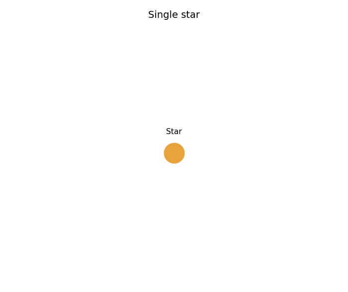

### star_planet
A planet orbiting a single star.

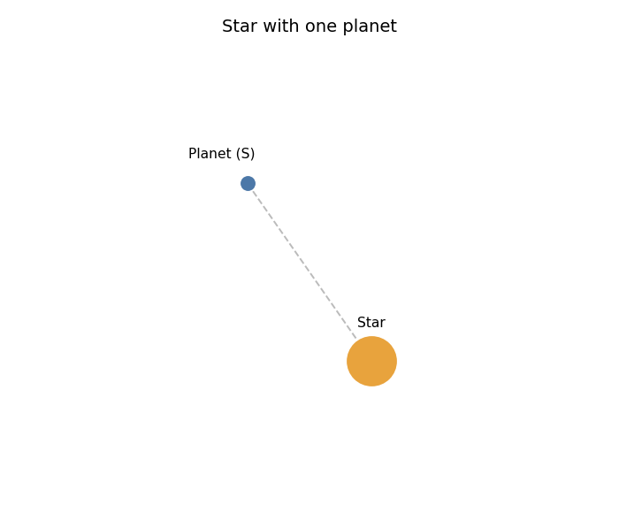

### star_planet_moon
A planet orbits the star and one moon orbits the planet.

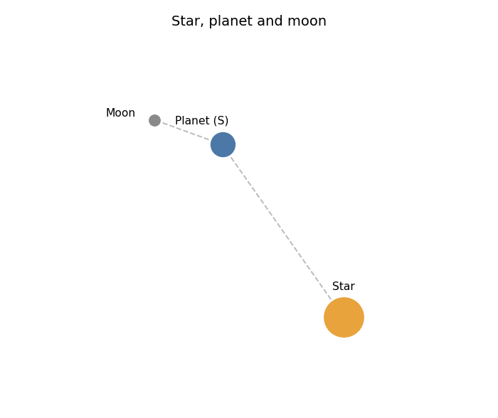

### star_two_planets
Two planets orbit a single star at different separations, for studying
planet-planet gravitational interactions without a stellar companion.

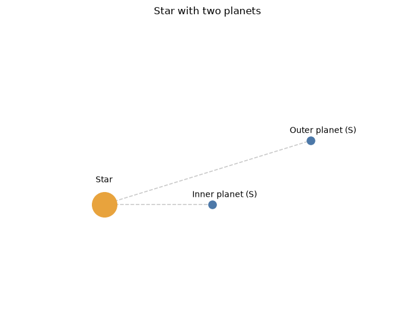

### star_two_planets_inner_moon
Two planets orbit a single star; a moon orbits the inner planet.

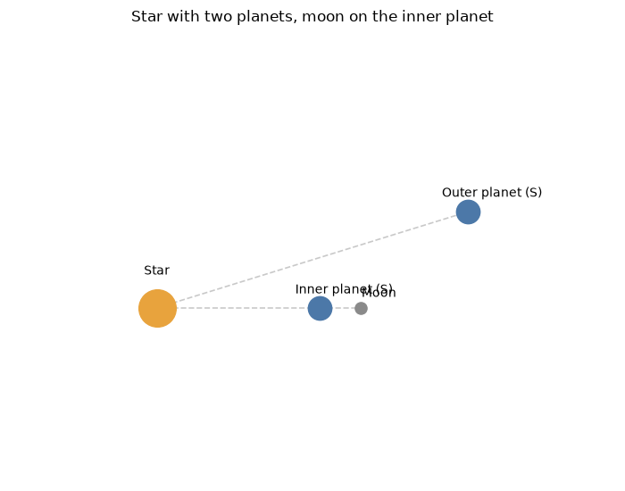

### star_two_planets_outer_moon
Two planets orbit a single star; a moon orbits the outer planet.

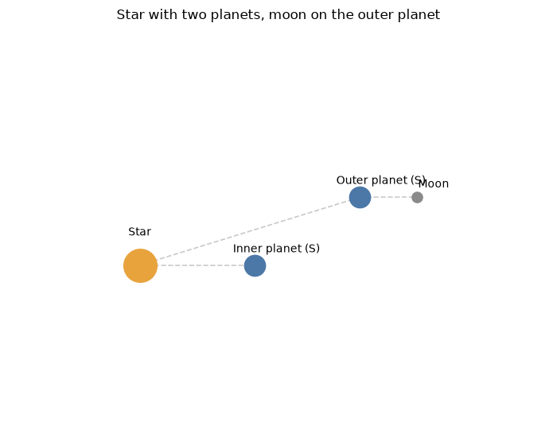

### binary_star
Two stars in a hierarchical binary.

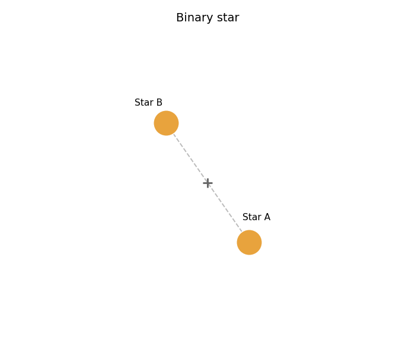

### binary_s_planet_primary
A planet orbits one component of a binary star (S-type, around the primary).

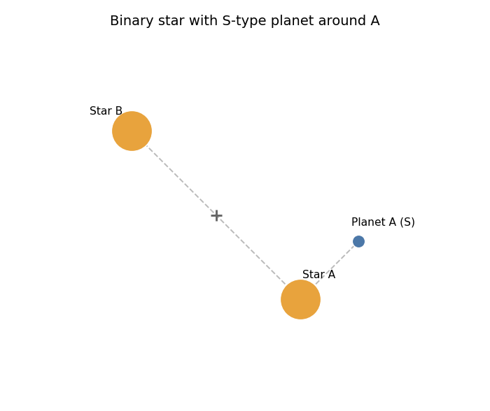

### binary_s_planet_secondary
A planet orbits the secondary component of a binary star (S-type).

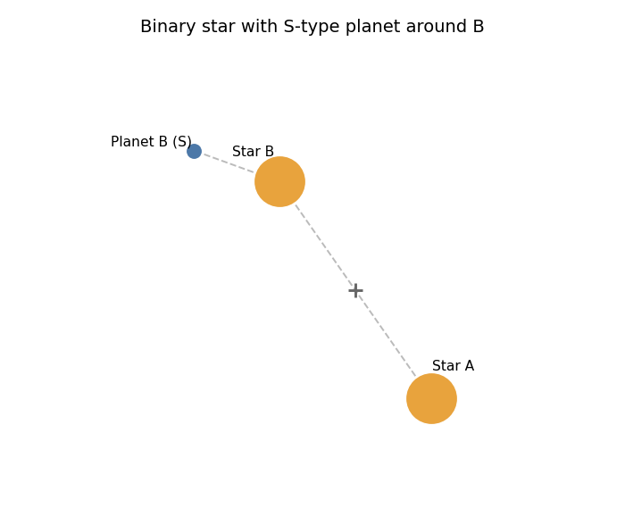

### binary_p_planet
A circumbinary planet orbits the binary barycenter (P-type).

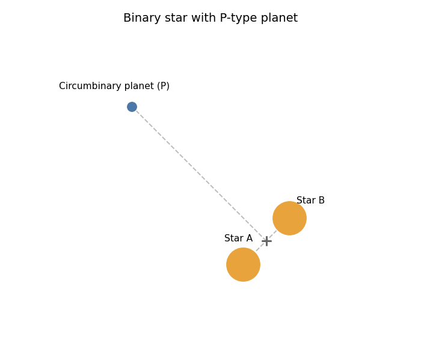

### binary_s_planet_moon
An S-type planet in a binary star has one moon.

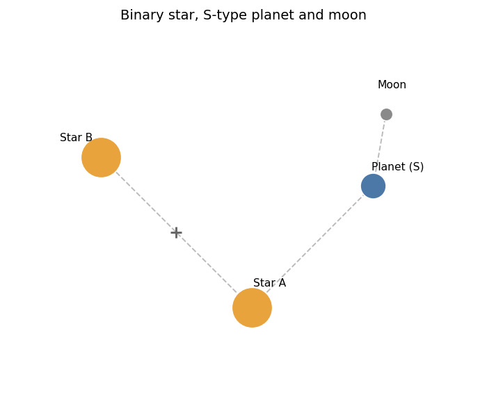

### binary_p_planet_moon
A circumbinary planet has one moon.

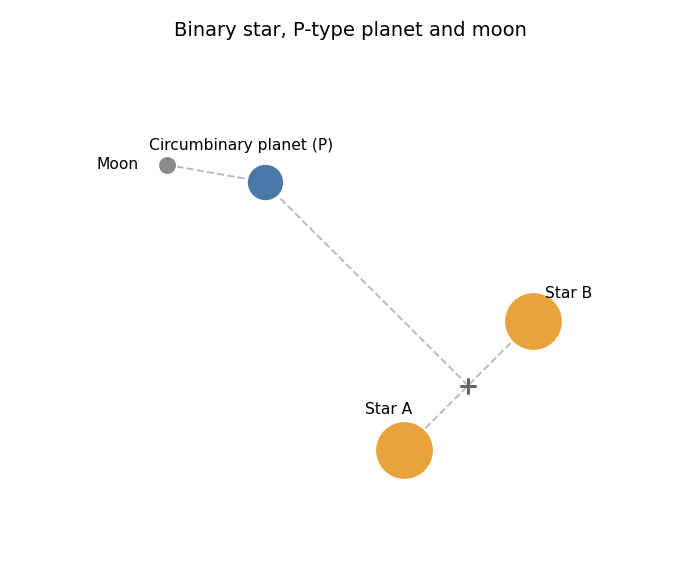

### binary_two_s_planets
Each stellar component has one S-type planet.

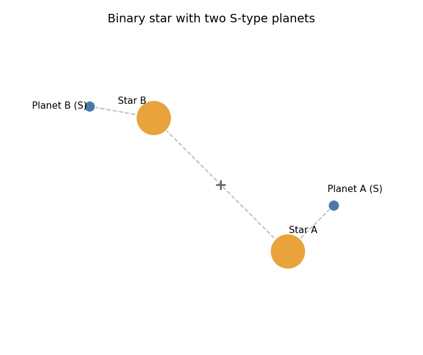

### binary_two_s_planets_one_moon
Each star has one S-type planet; one planet has a moon.

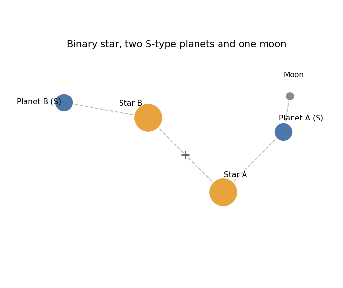

### binary_two_s_planets_same_star
Both planets orbit component A at different separations, for studying
planet-planet gravitational interactions within one star's Hill sphere.

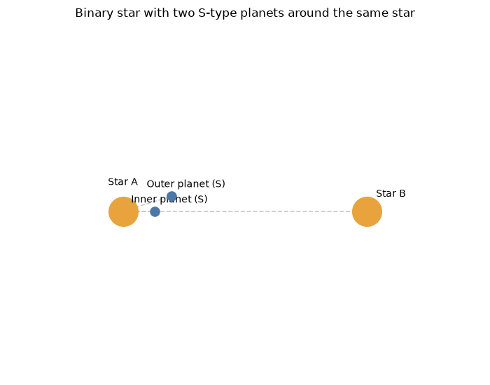

### binary_two_p_planets
Two circumbinary planets orbit the binary barycenter at different
distances, for studying planet-planet gravitational interactions between
P-type orbits.

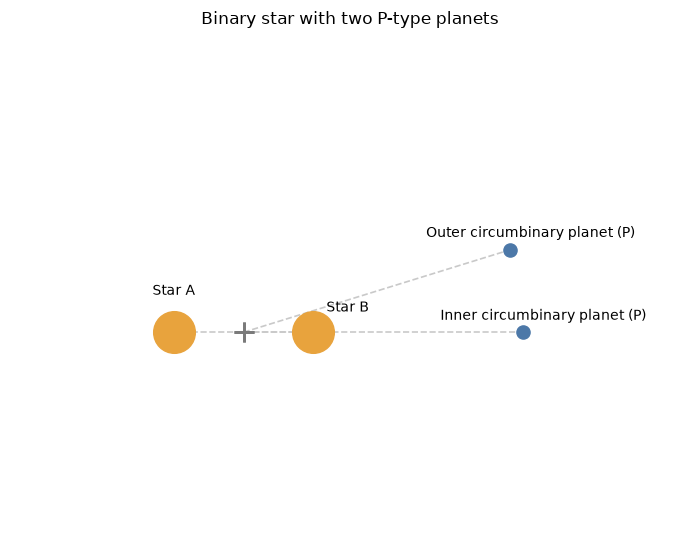

### triple_star_flat
Two stellar companions orbit the primary star directly.

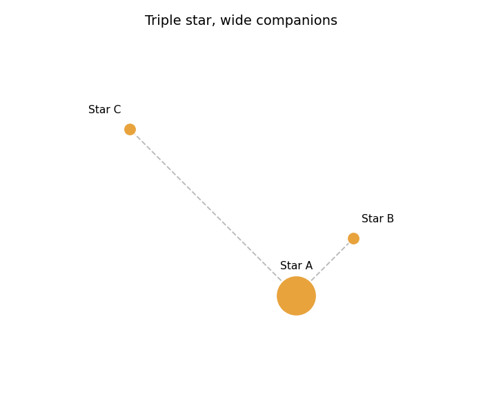

### triple_star_chain
A close stellar binary is orbited hierarchically by a third star.

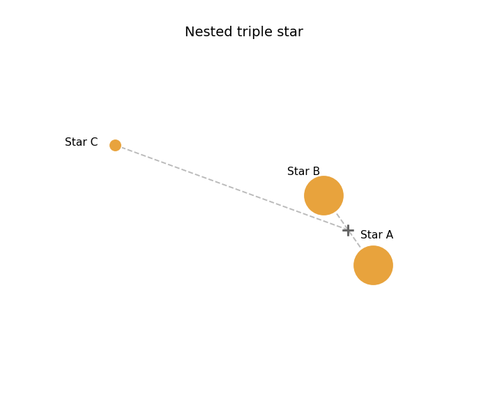

### triple_star_s_planet
A nested triple-star system with one planet orbiting one component.

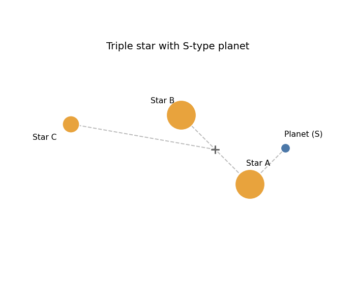

### triple_star_s_planet_c
A nested triple-star system with one planet orbiting the outer stellar
component, Star C.

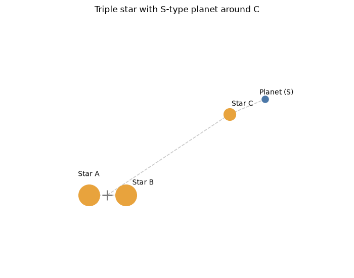

### triple_star_s_planet_moon
A planet orbiting one stellar component has one moon.

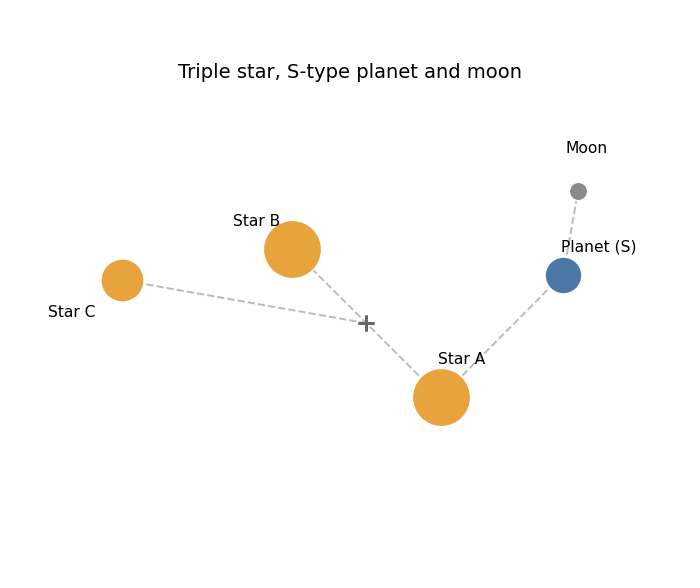

### triple_star_two_s_planets
Two planets orbit two different stellar components.

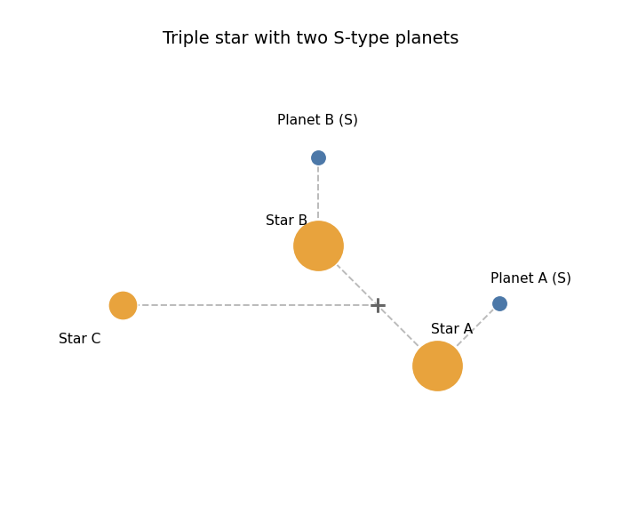

> **Jacobi-ordering convention.** Every body's orbit is anchored to the combined mass
> *and* combined barycenter of everything interior to it — its parent, any sibling
> that orbits closer in (smaller semi-major axis), and the parent's *entire* ancestor
> chain, each contributing in turn — not just its immediate parent in isolation. A
> sibling or ancestor link that's wider than the body's own orbit is excluded, treated
> as an external perturber instead. So in `binary_s_planet_primary`, Star B's orbit
> correctly accounts for Planet A's mass (negligible here, but not in general), while
> Planet A's own orbit correctly ignores the far-away Star B. And in
> `triple_star_chain`, Star C's orbit correctly accounts for *both* Star A and Star B
> combined — not just Star B, its immediate parent — which is why the diagrams above
> can use equal-mass twins for the inner pair instead of a lopsided ratio: a real
> hierarchical triple with two comparable-mass inner stars is now handled correctly.
> Both the diagrams above and `HierarchicalSystem._resolve()`/`_interior_reference()`
> use this same rule, so a heavy inner sibling or a whole inner subsystem visibly
> displaces where a wider body's orbit is anchored, in both. The same rule is applied
> by `src/exotides/plotting.py`'s `plot_orbital_elements`/`plot_pn_comparison` when computing
> a body's *osculating* elements or PN precession relative to a multi-body reference.

---

## Running the Verification Suite

### With pytest (fastest way to check everything passes)

Requires the package installed with the `test` extra (`pip install -e ".[test]"` from
`pyTIDES/`, see Getting Started above). Then, from `pyTIDES/`:

```bash
py -m pytest
```

(`pytest` alone also works if the command is on your `PATH`.) This discovers and runs all 19
tests under `pyTIDES/tests/` and prints a pass/fail summary -- no arguments, no need to name
individual files. It's the quickest way to confirm the whole verification suite still passes,
e.g. after a change. It does **not** generate any plots/animations: every test defaults to
skipping figure output under pytest for speed (see the next section to actually produce them).

Add `--cov=exotides --cov-report=term-missing` to also print a coverage report (requires
`pytest-cov`, included in the `test` extra).

### Running scripts directly (also generates plots/animations)

Requires the package installed first (`pip install -e .` from `pyTIDES/`, see Getting Started
above) -- the scripts import `exotides` as a regular installed package, no `sys.path`
manipulation involved. Each script in `pyTIDES/tests/` is also runnable directly, and this time
prints/asserts its own verification results *and* saves the plots/animations to `figures/`:

```bash
cd tests
python test_kepler.py            # Kepler two-body orbit vs. the C reference solution
python test_lorenz.py             # Lorenz chaotic system vs. the C reference solution
python test_hierarchy.py          # Every catalog template: trajectory plot (2D/3D) + orbital elements
python test_exoplanet_systems.py  # Real multi-star exoplanet systems (51 Peg b, Sun-Earth-Moon, ...)
python test_kozai_nbody.py        # Kozai-Lidov eccentricity/inclination oscillation
python test_relativity.py         # 1PN correction vs. the analytic GR precession formula
python test_fast_nbody.py         # Numba path vs. pure-Python core: correctness + speedup scaling with N bodies
python test_events.py             # Zero-crossing/collision event detection (terminal & non-terminal)
```

`test_kepler.py`/`test_lorenz.py` also accept an `mpfr` argument to run in
arbitrary precision instead of double: `python test_kepler.py mpfr`.

### Outputs
Plots and animations are saved to `pyTIDES/figures/` (created automatically).

---

## Design Notes & Related Work

[`docs/design-notes.md`](docs/design-notes.md) collects everything that doesn't belong in this
README: the TIDES method's lineage (the original C/Fortran/Mathematica implementation, why no
official Python port exists), a precise, code-level accounting of what "not general-purpose"
means here, and comparisons to other Taylor-series/N-body codes -- heyoka, REBOUND, and `kozai`.

---

## References

- Abad, A., Barrio, R., Blesa, F., & Rodríguez, M. (2012). "Algorithm 924: TIDES, a Taylor
  Series Integrator for Differential EquationS." *ACM Transactions on Mathematical
  Software*, 39(1), Article 5. -- the method this package reimplements in pure Python (see
  [`docs/design-notes.md`](docs/design-notes.md) for why no official Python port of the
  original C/Fortran/Mathematica TIDES exists).

See [`docs/design-notes.md`](docs/design-notes.md) for further references (REBOUND, heyoka,
`kozai`, Omnisode/`sode`) used in the comparisons there.

---

## License

This package (`exotides`/pyTIDES) is released under the [MIT License](LICENSE). The original
TIDES C library vendored separately under `../C/libTIDES` (see Directory Structure above and
[`docs/design-notes.md`](docs/design-notes.md) §1) is GPLv3 and unrelated to this license --
nothing in `exotides` or its test suite imports it.

See [CHANGELOG.md](CHANGELOG.md) for release notes.
